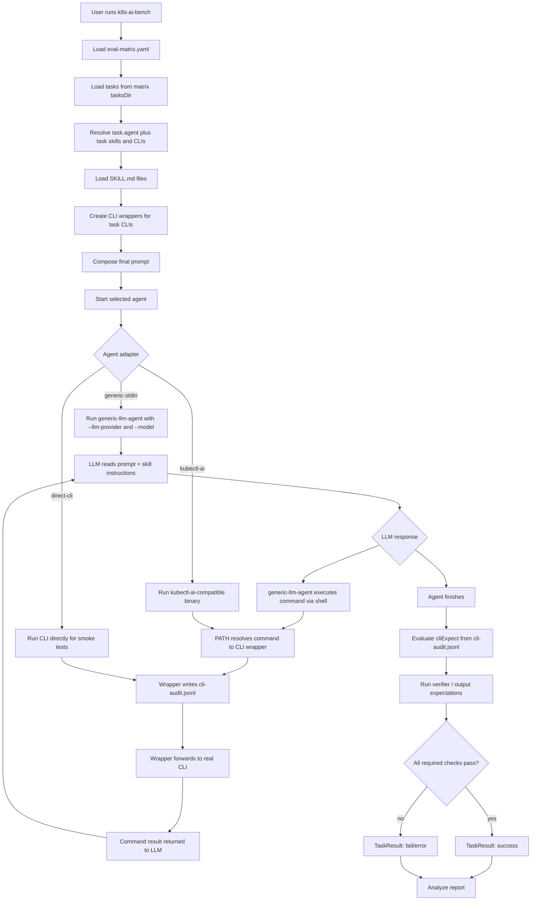

# Agent / Skill / CLI Matrix Benchmark 实现总结

本文总结本次对 `k8s-ai-bench` 的改造：从固定 `kubectl-ai` runner，扩展为可以用 matrix 编排 LLM agent 和 model，并由 task 直接声明 skills 与 CLI 的评测框架。

## 目标

核心目标是验证 LLM 是否能根据自然语言 prompt 和注入的 `SKILL.md`，自行推理并调用正确 CLI，而不是在 task 中写死具体命令。

当前推荐链路是：

```text
k8s-ai-bench
  -> generic-llm-agent
    -> LLM 根据 prompt + SKILL.md 推理
    -> 输出 <command>...</command>
    -> generic-llm-agent 执行命令
    -> PATH 命中 bench 生成的 CLI wrapper
    -> wrapper 审计并转发到真实 CLI
    -> verifier / cliExpect 判断是否通过
```

## 主要改动

### Matrix 配置

新增 `--matrix-file`，用 YAML 描述 agent、model、可选的本地 CLI/skill 基础目录、任务目录、输出目录和运行参数。

示例结构：

```yaml
skillsDir: ./skills
clisDir: ./clis
tasksDir: ./tasks/skill-cli
outputDir: .build/skill-cli-bench
clusterCreationPolicy: DoNotCreate

agents:
  - id: generic
    bin: ./generic-llm-agent
    adapter: generic-stdin
    args:
      - --max-iterations
      - "8"
      - --command-timeout
      - 3m

models:
  - id: example-model
    provider: openai
    model: example-model
    env:
      OPENAI_API_BASE: https://example.com/v1
      OPENAI_API_KEY: ${OPENAI_API_KEY}

runs:
  iterations: 1
  concurrency: 1
  taskPattern: "kpanda-cluster-diagnosis"
```

`generic-stdin` adapter 会自动把 matrix model 转成 agent 参数：

```text
--llm-provider <provider> --model <model>
```

matrix 模式下，`tasksDir`、`outputDir`、`clusterCreationPolicy` 都从 `eval-matrix.yaml` 读取。`skillsDir` 仅在 task 声明本地 `skills` 时需要，`clisDir` 仅在 task 声明本地 `clis` 时需要；像 Hermes bridge 这类服务端提供 skills 和 CLI 的模式可以省略二者。常规运行不再需要额外传目录类 flag。

`agents[].env` 和 `models[].env` 支持 `${VAR}` 形式的环境变量展开；实际密钥建议放在 shell 环境或 CI secret 中，matrix 文件只保留引用。

### Task Schema

task 可以显式声明使用哪个 agent，以及本任务需要注入哪些 skills、暴露哪些 CLIs：

```yaml
agent: generic

skills:
  - kpanda:cluster-diagnosis/SKILL.md

clis:
  - name: dce
    path: dce
    required: true

script:
  - prompt: |
      Diagnose the health of the Kubernetes cluster named kpanda-global-cluster.
      Follow the provided Kpanda cluster diagnosis workflow.
      Do not remediate anything; only inspect and report findings.

cliExpect:
  - name: dce
    required: true
    argvContains:
      - container-management
      - cluster

verifier: verify.sh
difficulty: medium
timeout: 10m
```

注意：这里不写死 `args`。具体命令应由 LLM 根据 prompt 和 skill 推理出来。

### Generic LLM Agent

新增二进制入口：

```text
cmd/generic-llm-agent/main.go
```

构建方式：

```sh
go build -o generic-llm-agent ./cmd/generic-llm-agent
```

支持参数：

```text
--llm-provider gemini|openai
--model <model>
--max-iterations <n>
--command-timeout <duration>
```

`--max-iterations` 是单次 task 内部的 LLM/command 循环上限；需要先执行 CLI 再根据结果总结的任务通常至少要 2，建议设为 4-8。它不同于 matrix 的 `runs.iterations`。

协议很薄：

```text
<command>
dce container-management cluster get-cluster --name kpanda-global-cluster -o json
</command>
```

或：

```text
<final>
诊断结论...
</final>
```

agent 执行 `<command>` 后，会把 stdout、stderr 和 exit code 包装成 `<command_result>` 追加回对话，继续让 LLM 推理下一步。

### Hermes API Bridge

新增 Hermes bridge 二进制入口：

```text
cmd/k8s-ai-hermes-bridge/main.go
```

构建方式：

```sh
go build -o k8s-ai-hermes-bridge ./cmd/k8s-ai-hermes-bridge
```

它用于调用 `token-factory-copilot` 部署的 Hermes Agent API Server `:8642`：

```sh
kubectl -n tokenfactory-system port-forward svc/tokenfactory-copilot-hermes-agent 8642:8642
```

运行前需要设置：

```sh
export COPILOT_HERMES_BASE_URL=http://127.0.0.1:8642/v1
export COPILOT_HERMES_API_KEY=<API_SERVER_KEY>
export COPILOT_HERMES_MODEL=hermes-agent
export COPILOT_HERMES_TIMEOUT=1800s
```

matrix 示例：

```yaml
agents:
  - id: hermes
    bin: ./k8s-ai-hermes-bridge
    adapter: generic-stdin

models:
  - id: qwen3-coder
    provider: openai
    model: Qwen/Qwen3-Coder-480B-A35B-Instruct
```

仓库内提供了独立示例：

```sh
go build -o k8s-ai-hermes-bridge ./cmd/k8s-ai-hermes-bridge
./k8s-ai-bench run --matrix-file eval-matrix-hermes.yaml
```

`eval-matrix-hermes.yaml` 使用 `tasks/skill-cli-hermes`。该 task 不声明本地 `skills` / `clis` / `cliExpect`，因为 Hermes bridge 的 skills 加载和 CLI 调用发生在服务端 Hermes Agent 环境中，不会命中 bench 本地 skill 注入或 CLI wrapper。

这里使用 `generic-stdin` adapter，因为 Hermes bridge 本质上是 stdin prompt runner。bench 会把组装好的 prompt 写入 stdin，并自动追加：

```text
--llm-provider
--model
```

Hermes bridge 仍兼容旧 `kubectl-ai` 风格参数，例如：

```text
--kubeconfig
--trace-path
--quiet
--enable-tool-use-shim
--skip-permissions
--show-tool-output
--mcp-client
```

这些参数用于历史兼容和独立调试，不是 matrix 推荐路径。v1 使用 `generic-stdin` 时不强制注入 `trace.yaml`；Hermes bridge 会在 `K8S_AI_BENCH_TASK_OUTPUT_DIR` 存在时写出 `hermes-trace.json`，方便确认请求确实经过 Hermes API。若后续需要统一 trace 文件名，可再扩展 `generic-stdin` 的可选 trace 注入能力。

Hermes bridge 与 `generic-llm-agent` 的区别：

- `generic-llm-agent` 在本地执行 `<command>`，因此会命中 bench 生成的 CLI wrapper。
- `k8s-ai-hermes-bridge` 只把 prompt 转发给 Hermes API；skills、CLI、tool execution、agent loop、LLM routing 都由 Hermes 服务端负责。
- bridge 不桥接本地 kubeconfig 文件，只把 `--kubeconfig` 作为 metadata 写入 trace 和 system prompt。
- 默认情况下，matrix 的 `--model` 只作为 benchmark metadata；Hermes request model 使用 `COPILOT_HERMES_MODEL`。如果 Hermes 支持 request-level model routing，可设置 `COPILOT_HERMES_USE_BENCH_MODEL=true`。

### CLI Wrapper 与审计

`k8s-ai-bench` 会为当前 task 声明的 CLI 生成 wrapper，并把 wrapper 目录 prepend 到 `PATH`。

例如 task 声明：

```yaml
clis:
  - name: dce
    path: dce
    required: true
```

运行时 agent 调用：

```sh
dce container-management cluster get-cluster ...
```

实际命中：

```text
.build/.../cli-wrappers/dce
```

调用链如下：

```text
generic-llm-agent
  -> 执行 dce container-management cluster get-cluster ...
  -> shell 按 PATH 查找 dce
  -> 命中 .build/.../cli-wrappers/dce
  -> wrapper 调用真实 ./clis/dce
  -> wrapper 写入 cli-audit.jsonl
  -> stdout / stderr / exit code 原样返回给 agent
```

wrapper 的作用是把“agent 是否真的调用过 CLI”变成可验证事实，而不是相信 agent 的自然语言描述。它会：

1. 调用真实 CLI：`./clis/dce`
2. 记录 `cli-audit.jsonl`
3. 透传 stdout、stderr、exit code

审计记录示例：

```json
{"name": "dce", "argv": ["container-management", "cluster", "get-cluster", "--name", "kpanda-global-cluster", "-o", "json"], "exitCode": 0}
```

随后 `cliExpect` 会读取该审计文件并判断：

```yaml
cliExpect:
  - name: dce
    required: true
    argvContains:
      - container-management
      - cluster
```

判断逻辑：

- `required: true` 要求至少调用过该 CLI。
- `argvContains` 要求某次调用的参数中包含这些片段。
- 如果 required CLI 没有调用，或者参数不匹配，task 会失败。

为避免污染 agent 环境，bench 只为当前 task 的 `clis` 中声明的 CLI 生成 wrapper，不会把所有 `clis/` 目录里的工具一次性暴露出去。

### 结果模型

`TaskResult` 增加：

```text
agentID
iteration
cliResults
```

`cliResults` 用来记录：

```text
CLI 是否被调用
required CLI 是否满足
argvContains 是否匹配
实际调用列表
```

### Analyze 适配

`analyze` 可以直接读取 matrix 文件里的 `outputDir`：

```sh
./k8s-ai-bench analyze \
  --matrix-file eval-matrix.yaml \
  --output-format markdown \
  --results-filepath .build/skill-cli-bench/report.md \
  --show-failures
```

也可以继续显式指定输入目录：

```sh
./k8s-ai-bench analyze \
  --input-dir .build/skill-cli-bench \
  --output-format markdown
```

matrix 模式下，Markdown 报告会优先展示：

```text
| Agent | Model | Task | Runs | Task Success | Required CLI Match | Error |
```

详细结果表包含：

```text
| Agent | Task | Iteration | Provider | Required CLI | Result |
```

其中：

- `Agent` 来自 task 的 `agent` 字段。
- `Iteration` 来自 matrix 的 `runs.iterations` 展开结果。
- `Required CLI` 来自 `cliResults`，显示 required CLI 是否满足；legacy task 没有 required CLI 时显示 `n/a`。
- `Required CLI Match` 表示 required CLI 调用和 `argvContains` 是否匹配，不等同于最终 task success。最终 success 还要求 verifier / expect 通过。

JSON / JSONL 输出会保留完整明细，包括：

```text
agentID
iteration
cliResults
failures
error
```

### 输出目录

输出目录按矩阵维度分层，避免多 agent / model / iteration 互相覆盖：

```text
.build/skill-cli-bench/
  iteration-1/
    kpanda-cluster-diagnosis/
      generic/
        example-model/
          task-skills/
            results.yaml
            log.txt
            trace.yaml
            prompt.txt
            cli-audit.jsonl
```

## 逻辑流程图



## 当前示例

当前示例使用：

```text
Skill: skills/kpanda:cluster-diagnosis/SKILL.md
CLI:   clis/dce
Task:  tasks/skill-cli/kpanda-cluster-diagnosis/task.yaml
```

运行前构建：

```sh
go build -o k8s-ai-bench .
go build -o generic-llm-agent ./cmd/generic-llm-agent
```

运行：

```sh
./k8s-ai-bench run \
  --matrix-file eval-matrix.yaml
```

分析：

```sh
./k8s-ai-bench analyze \
  --matrix-file eval-matrix.yaml \
  --output-format markdown \
  --results-filepath .build/skill-cli-bench/report.md \
  --show-failures
```

## 适用边界

- `generic-llm-agent` 是最小实现，不是完整生产级 agent。
- 当前工具调用协议依赖 LLM 输出 `<command>` / `<final>` 标签。
- CLI 安全控制主要依赖 benchmark 环境、PATH wrapper 和 task timeout。
- `direct-cli` adapter 只适合 CLI smoke test，不适合验证 LLM 推理能力。
